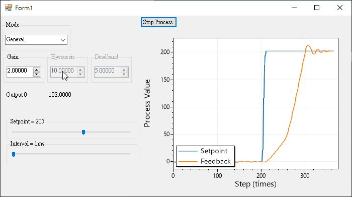
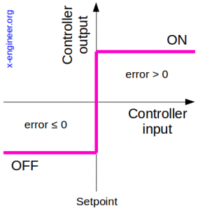
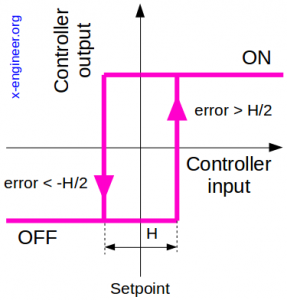
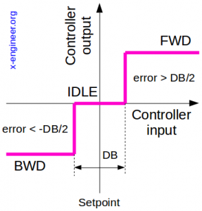
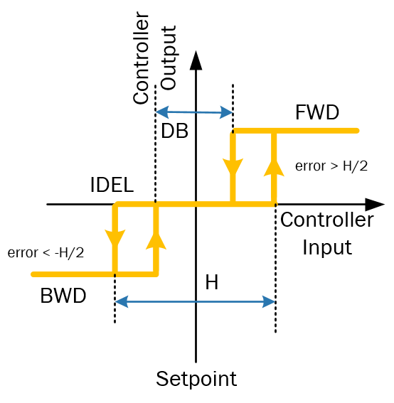

# ON_OFF_Controller.cs



## Example

### General on-off control output



```c#
var generl_ctrl = new ON_OFF_Controller_general();
int OnOff = generl_ctrl.Update_Once(this.setpoint, this.plant_feedback);

if (OnOff == 1)
    this.controller_output += gain;
if (OnOff == 0)
    this.controller_output -= gain;
```

### On-off control with hysteresis output



```c#
private ON_OFF_Controller_hysteresis hysteresis_ctrl;
void initialize()
{
    this.hysteresis_ctrl = new ON_OFF_Controller_hysteresis(hysteresis); 
}
```

```c#
int OnOff = this.hysteresis_ctrl.Update_Once(this.setpoint, this.plant_feedback);

if (OnOff == 1)
    this.controller_output += gain;
if (OnOff == 0)
    this.controller_output -= gain;
```

### On-off control with dead-band output



```c#
private ON_OFF_Controller_deadband deadband_ctrl;
void initialize()
{
    this.deadband_ctrl = new ON_OFF_Controller_deadband(deadband);
}
```

```c#
int OnOff = this.deadband_ctrl.Update_Once(setpoint, plant_feedback);

if (OnOff == 1) // FWD
	this.controller_output += this.gain;
if (this.OnOff == 0) // IDLE
    this.controller_output = this.controller_output; 
 if (OnOff == -1) // BWD  
     this.controller_output -= this.gain;
```

### On-off control with dead-band + hysteresis




# _ (┐「ε:) _

